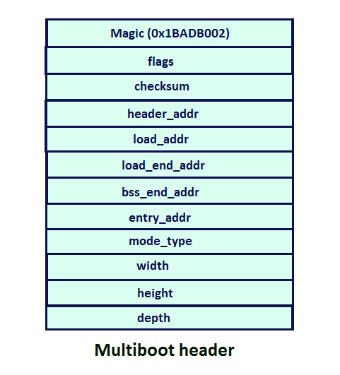

# kernel.git

Kernel desarrollado de forma didáctica para comprender el funcionamiento interno de un sistema operativo.
La referencia que se ha seguido para el desarrollo de este proyecto es *https://youtu.be/1rnA6wpF0o4*

# Creación de un sistema operativo

## Proceso de encendido

1.- Cuando el ordenador se enciende, se debe **cargar el firmware**. Para ello, se carga en RAM la información que se encuentra en la BIOS y se actualiza el **registro IP (Instruction Pointer)** para que apunte a la dirección de memoria donde se encuentra el firmware.

2.- En la ejecución del firmware, se trata la detección de periféricos donde cabe destacar la comunicación con el disco duro. La primera operación trata de cargar en RAM el **bootloader** , el cual se encuentra almacenado en la primera partición del disco: el **MBR (Master Boot Record)**. Para proceder a su ejecución se actualiza el registro IP.

El bootloader conoce mucho mejor la estructura interna del disco (particiones, formatos, etc), con lo que podrá dirigirse al fichero `/boot/grub/grub.cfg` de la segunda partición. En este fichero, es donde se encuentra la información concreta sobre los sistemas operativos disponibles en el disco de tal forma que pueda mostrar por pantalla las distintas opciones y las particiones correspondientes a cada S.O.

3.- Una vez elegido el S.O. que se quiere ejecutar, se carga en RAM el fichero `/boot/kernel.bin` de esa partición y se actualiza el IP.

Antes de ejecutarse, el bootloader debe identificar el fichero como un kernel. Para ello, asocia una cabecera llamada **multiboot** que tiene los ciertos parámetros y cuyo puntero es guardado en el **registro AX**. Además, el valor campo **Magic Number** (identificador de multiboot) también lo almacena en el **registro BX**.

## El kernel &quot;Hola Mundo&quot;

La elaboración del kernel se hará usando el lenguaje de programación C++. Sin embargo, tenemos que tener en cuenta que el bootloader no hace uso del **registro SP (Stack Pointer)** y C++, como la mayoría de los lenguajes de programación, da por supuesto que la pila se ha ajustado antes de la ejecución del programa.

Para resolver esta situación, crearemos tres ficheros:
 
- `loader.s`  - En ensamblador que se ocupe de la inicialización de la pila.

- `kernel.cpp`  - En C++ que sea el kernel como tal.

- `linker.ld`  - Script que se ocupará de fusionar los dos ficheros.

Antes de empezar, debemos asegurarnos de que tenemos instaladas las herramientas necesarias:
`g++`,`binutils`, `libc6-dev-i386`, `make`

Para facilitar el trabajo, creamos nuestro `makefile`:

Ahora, como ya hemos dicho, `loader.s` debe inicializar el registro SP. En este caso, dejaremos un espacio de `2MiB` y, a continuación, la pila.

![] (readme-res/001-0070_RAM-pila.png)

Por tanto, creamos nuestro loader.s:

Sin embargo, debemos recordar que de momento no hay sistema operativo. Entonces las excepciones y errores no se recogen por nadie, ni el uso de la memoria de forma dinámica. Para ello, debemos decirle al compilador que no asuma que hay un sistema operativo que trate con estas dos características.

Entonces, en el `makefile`, añadimos algunos parámetros más al compilador `g++`:

En este punto, vamos a crear nuestro `kernel.cpp`:

Como podemos ver, este fichero no puede compilar, ya que la función `printf` no está declarada y no podemos importar ninguna librería: no tenemos ninguna librería, ni el linker dinámico del sistema operativo, ni reasignación dinámica de memoria, ni controladores para escribir en pantalla, … Por tanto, nos toca codificar nuestro `printf`. En nuestro caso, vamos a hacerlo muy simple.

Para empezar, necesitaremos saber algunas peculiaridades sobre la pantalla. En la dirección de memoria `0xb8000`, tenemos un espacio de direccionamiento en el cual podemos introducir valores que se mostrarán en pantalla. La forma en que funciona trata parejas de bytes, de tal forma que el valor más a la izquierda almacena la información sobre el color y el dato de la derecha, el carácter.

La información de color viene prestablecida, así que, si no sobrescribimos los datos en esas posiciones de memoria y rellenamos únicamente las posiciones con información del carácter, tendremos un contraste adecuado por defecto.

Con esta teoría, estamos en disposición de crear nuestra función `void printf(char\* str)` en nuestro `kernel.cpp` . Así queda nuestro código final:

Ahora, vamos con el script `linker.ld` . Este es necesario porque tenemos archivos de distintos lenguajes de programación; si fuesen del mismo lenguaje, solo con el compilador seríamos capaces de hacer el arreglo. Entonces, el script para nuestro caso es el siguiente:

El último paso es compilar todo y dejar que el linker fusione los dos ficheros:

Nos aparece un `warning` en el método `printf`: estamos convirtiendo una constante de tipo `string` en un puntero de `char`. Vamos a ignorarlo porque es precisamente nuestra intención.

Como podemos observar, `kernel.bin` será el archivo (que colocaremos en `/boot/`) que cargará el bootloader en RAM tras ejecutarse la entrada correspondiente del `grub`.
